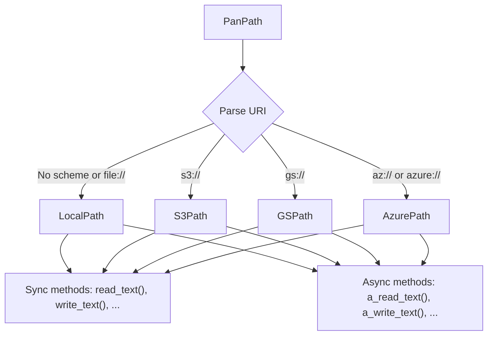

# Basic Concepts

Understanding PanPath's architecture and design principles will help you use it effectively.

## Core Principles

### 1. Unified Interface

PanPath provides a single, consistent API that works across different storage backends:

```python
from panpath import PanPath

# All these use the same interface
local = PanPath("/tmp/file.txt")
s3 = PanPath("s3://bucket/file.txt")
gcs = PanPath("gs://bucket/file.txt")
azure = PanPath("az://container/file.txt")

# Same operations work on all
for path in [local, s3, gcs, azure]:
    path.write_text("Same API")
    content = path.read_text()
    print(path.exists())
```

### 2. Pathlib Compatibility

For local files, PanPath is a drop-in replacement for `pathlib.Path`:

```python
from pathlib import Path
from panpath import PanPath

# These work identically for local paths
pathlib_path = Path("/tmp/file.txt")
pan_path = PanPath("/tmp/file.txt")

# Same operations
pathlib_path.write_text("Hello")
pan_path.write_text("Hello")

# Same properties
assert pathlib_path.name == pan_path.name
assert pathlib_path.suffix == pan_path.suffix
```

### 3. Unified Sync and Async

Every path class provides both synchronous and asynchronous methods:

```python
from panpath import PanPath

# Create a path - same class for both sync and async
path = PanPath("s3://bucket/file.txt")

# Synchronous methods (blocks until complete)
content = path.read_text()  # Blocks

# Asynchronous methods use a_ prefix (non-blocking)
content = await path.a_read_text()  # Non-blocking

# Both sync and async methods available on same instance
path.write_text("sync write")  # Sync
await path.a_write_text("async write")  # Async
```

## Architecture

### Path Resolution

PanPath uses URI schemes to route to the appropriate backend:



### Client Management

Cloud clients are created lazily and reused:

```python
from panpath import PanPath

# First S3 path creates a client
path1 = PanPath("s3://bucket1/file.txt")

# Second S3 path reuses the same client
path2 = PanPath("s3://bucket2/file.txt")

# Different backend creates a different client
path3 = PanPath("gs://bucket/file.txt")
```

!!! tip "Performance"
    Client reuse means you don't pay the initialization cost for each path instance.

### Registry System

Path classes are registered by URI scheme:

```python
from panpath.registry import register_path_class, get_path_class
from panpath.s3_path import S3Path

# Registration (automatic for built-in backends)
register_path_class("s3", S3Path)

# Retrieval (used internally)
path_class = get_path_class("s3")  # Returns S3Path
```

## Path Classes

### Unified Path Classes

```python
from panpath import PanPath
from panpath.s3_path import S3Path

# Factory pattern - PanPath returns appropriate class
path = PanPath("s3://bucket/file.txt")
print(type(path))  # <class 'panpath.s3_path.S3Path'>

# All methods available on same instance
content = path.read_text()  # Sync
content = await path.a_read_text()  # Async

# Type checking
isinstance(path, PanPath)  # True (inherits from PanPath)
isinstance(path, S3Path)   # True (actual type)
```

!!! note "Async Methods"
    All async methods are prefixed with `a_` for easy identification:

    - `read_text()` → `a_read_text()`
    - `write_bytes()` → `a_write_bytes()`
    - `exists()` → `a_exists()`
    - `iterdir()` → `a_iterdir()`

### Type Preservation

Path operations preserve the type and mode:

```python
from panpath import PanPath

# Sync S3 path
sync_path = PanPath("s3://bucket/data/file.txt")
sync_parent = sync_path.parent  # Still sync S3Path
sync_sibling = sync_parent / "other.txt"  # Still sync S3Path

# Async S3 path
async_path = PanPath("s3://bucket/data/file.txt", mode="async")
async_parent = async_path.parent  # Async S3Path
async_sibling = async_parent / "other.txt"  # Async S3Path
```

This means you can chain operations without worrying about type changes:

```python
path = PanPath("s3://bucket/deep/nested/file.txt", mode="async")

# All these preserve async mode
new_path = (path
    .parent           # async
    .parent           # async
    / "other"         # async
    / "file.txt")     # async

# Still async!
await new_path.write_text("content")
```

## Storage Concepts

### Local Paths

Local paths represent files and directories on the filesystem:

```python
from panpath import PanPath

path = PanPath("/tmp/file.txt")
# or
path = PanPath("file:///tmp/file.txt")

# Supports all pathlib operations
path.resolve()
path.absolute()
path.expanduser()
```

### Cloud Paths

Cloud paths use URI schemes to represent cloud storage objects:

```python
from panpath import PanPath

# Format: scheme://bucket_or_container/key_or_path
s3 = PanPath("s3://my-bucket/path/to/object.txt")
gcs = PanPath("gs://my-bucket/path/to/object.txt")
azure = PanPath("az://my-container/path/to/blob.txt")
```

Key differences from local paths:

- **No absolute/relative distinction**: All cloud paths are absolute
- **No symlinks**: Cloud storage doesn't support symbolic links
- **Different permissions model**: Uses cloud IAM instead of filesystem permissions
- **No hard links**: Each object is independent

### Buckets and Containers

The first component after the scheme is the bucket (S3/GCS) or container (Azure):

```python
from panpath import PanPath

s3_path = PanPath("s3://my-bucket/folder/file.txt")
print(s3_path.parts)  # ('s3://my-bucket', 'folder', 'file.txt')

# Cloud-specific properties
print(s3_path.cloud_prefix)  # s3://my-bucket
print(s3_path.key)           # folder/file.txt
```

## Operations

### Synchronous Operations

Block until completion:

```python
from panpath import PanPath

path = PanPath("s3://bucket/file.txt")

# These block the thread
content = path.read_text()
path.write_text("new content")
exists = path.exists()
items = list(path.iterdir())
```

**Use when:**

- Writing simple scripts
- Working in synchronous frameworks (Flask, Django)
- Operations are infrequent
- Code simplicity is more important than concurrency

### Asynchronous Operations

Return coroutines that can be awaited:

```python
from panpath import AsyncPanPath
import asyncio

async def main():
    path = AsyncPanPath("s3://bucket/file.txt")

    # These are non-blocking
    content = await path.read_text()
    await path.write_text("new content")
    exists = await path.exists()
    items = await path.iterdir()

asyncio.run(main())
```

**Use when:**

- Building async applications (FastAPI, aiohttp)
- Need high concurrency
- Performing many I/O operations
- Want better resource utilization

### Parallel Async Operations

Async mode enables concurrent operations:

```python
import asyncio
from panpath import AsyncPanPath

async def download_all(urls):
    # Create async paths
    paths = [AsyncPanPath(url) for url in urls]

    # Download all concurrently
    contents = await asyncio.gather(*[p.read_text() for p in paths])

    return contents

urls = [
    "s3://bucket/file1.txt",
    "s3://bucket/file2.txt",
    "s3://bucket/file3.txt",
]
asyncio.run(download_all(urls))
```

## Error Handling

### Common Exceptions

```python
from panpath import PanPath
from panpath.exceptions import (
    PanPathException,
    PathNotFoundError,
    PermissionError,
)

path = PanPath("s3://bucket/nonexistent.txt")

try:
    content = path.read_text()
except PathNotFoundError:
    print("File not found")
except PermissionError:
    print("Access denied")
except PanPathException as e:
    print(f"Other error: {e}")
```

### Backend-Specific Errors

Cloud backends may raise provider-specific errors:

```python
from panpath import PanPath
import botocore.exceptions

path = PanPath("s3://bucket/file.txt")

try:
    content = path.read_text()
except botocore.exceptions.NoCredentialsError:
    print("AWS credentials not configured")
except botocore.exceptions.ClientError as e:
    print(f"AWS error: {e}")
```

## Best Practices

### 1. Use Type Hints

```python
from panpath import PanPath, AsyncPanPath
from pathlib import Path

def process_file(path: PanPath) -> str:
    """Can be sync or async path."""
    return path.read_text()

async def process_async(path: AsyncPanPath) -> str:
    """Must be async path."""
    return await path.read_text()

def process_local(path: Path | PanPath) -> str:
    """Accept pathlib.Path or PanPath."""
    if isinstance(path, Path):
        path = PanPath(str(path))
    return path.read_text()
```

### 2. Handle Optional Dependencies

```python
from panpath import PanPath

def get_data(uri: str) -> str:
    try:
        path = PanPath(uri)
        return path.read_text()
    except ImportError as e:
        raise RuntimeError(
            f"Cloud backend not installed: {e}\n"
            f"Install with: pip install panpath[s3]"
        )
```

### 3. Use Context Managers

```python
from panpath import PanPath

# Good: File is automatically closed
with PanPath("s3://bucket/file.txt").open("r") as f:
    content = f.read()

# Also good for async
from panpath import AsyncPanPath

async def read_file():
    async with AsyncPanPath("s3://bucket/file.txt").open("r") as f:
        content = await f.read()
```

### 4. Prefer Bulk Operations

```python
from panpath import PanPath

# Less efficient: Individual copies
src_dir = PanPath("s3://bucket/data/")
dst_dir = PanPath("gs://other/data/")
for item in src_dir.iterdir():
    item.copy(dst_dir / item.name)

# More efficient: Use copytree
src_dir.copytree(dst_dir)
```

## Next Steps

- [Local Paths Guide](../guide/local-paths.md) - Learn about local filesystem operations
- [Cloud Storage Guide](../guide/cloud-storage.md) - Cloud-specific features
- [Async Operations Guide](../guide/async-operations.md) - Deep dive into async
- [API Reference](../api/pan-path.md) - Complete API documentation
